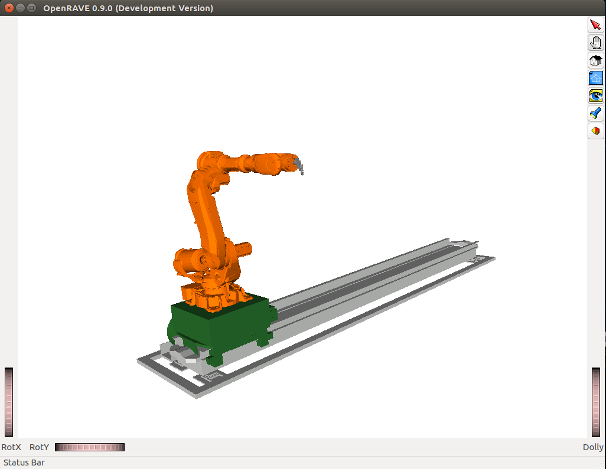
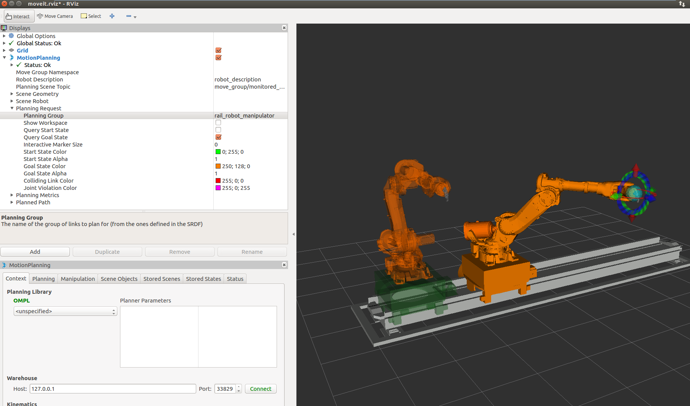

In this section, we will walk through configuring an IKFast plugin for MoveIt! This tutorial is a updated version of the archived `moveit-ikfast tutorial for ros-kinetic <http://docs.ros.org/kinetic/api/moveit_tutorials/html/doc/ikfast_tutorial.html>`_. The standard tutorial does not have enough example to exemplify the ikfast generation for 6+1 dof (especially 6 dof + linear track) setting. This tutorial means to complement this missing part with detailed instruction and examples. 

This tutorial have the following new features compared to the official kinetic one::

	1. Updated openrave installation for ros-kinetic
	2. Examples added in each sections. Examples are dedicated to industrial robot and related setups.
	3. References and guidance added for setting up `free-index` for 7-dof robot, with focus on 6-axis industrial robot + 1 dof linear track scenario.

`Yijiang Huang's post <https://github.com/ros-industrial-consortium/descartes/issues/210>`_ on `Descartes <https://github.com/ros-industrial-consortium/descartes/issues>`_ package's github issue and `ROS Answer <https://answers.ros.org/question/285611/set-free_index-for-7-dof-robots-ikfast-moveit-plugin-generation/>`_ initiated the (re-)creation of this tutorial.

---------------------------------------
Introduction to IKFast and prerequisite
---------------------------------------

What is IKFast?
^^^^^^^^^^^^^^^
*From Wikipedia:*
IKFast, the Robot Kinematics Compiler, is a powerful inverse kinematics solver provided within Rosen Diankov's OpenRAVE motion planning software. Unlike most inverse kinematics solvers, IKFast can analytically solve the kinematics equations of any complex kinematics chain, and generate language-specific files (like C++) for later use. The end result is extremely stable solutions that can run as fast as 5 microseconds on recent processors

MoveIt! IKFast
^^^^^^^^^^^^^^
MoveIt! IKFast is a tool that generates a IKFast kinematics plugin for MoveIt using OpenRave generated cpp files.

This tutorial will step you through setting up your robot to utilize the power of IKFast. MoveIt! IKFast is tested on ROS Kinetic with Catkin using **OpenRave 0.9.0** with a 6dof and 7dof robot arm manipulator. 
While it works in theory, currently the IKFast plugin generator tool does not work with >7 degree of freedom arms.

Pre-requisites
^^^^^^^^^^^^^^
You should have already created a urdf or xacro file for your robot. In addition, you need the following packages:

MoveIt! IKFast Installation
"""""""""""""""""""""""""""

Note that from ROS-indigo, `moveit-ikfast <https://github.com/ros-planning/moveit_ikfast>`_ is archived and the package has been integrated as a part of the *moveit_kinematics* package under `moveit! motion planning framework <https://github.com/ros-planning/moveit>`_.

**Binary Install** ::

 sudo apt-get install ros-kinetic-moveit

**Check moveit_kinematics installation**::

 rospack find moveit_kinematics

.. _OpenraveInstallation:

OpenRAVE Installation
"""""""""""""""""""""

Note that for Ubuntu 16.04 (Xenial), openrave does not have a release file on ppa.launchpad.net. Thus the traditional "sudo apt-get" in `ikfast indigo tutorial <http://docs.ros.org/indigo/api/moveit_ikfast/html/doc/ikfast_tutorial.html>`_ does not work in 16.04 Xenial.

Before proceeding on building openrave from source, if you are using ROS-indigo. I recommend you to try installing a pre-cooked ROS-openrave package from ``personalrobotics/ros-openrave`` Docker image, following instruction from gvdhoorn in `this post <https://answers.ros.org/question/263925/generating-an-ikfast-solution-for-4-dof-arm/?answer=265625#post-id-265625>`[1].

Thus we need to build openrave from src, `Stéphane Caron's blog <https://scaron.info/teaching/installing-openrave-on-ubuntu-16.04.html>`_ and `Francisco Suárez-Ruiz's blog <https://fsuarez6.github.io/blog/workstation-setup-xenial/>`_ give good instructions on how to install openrave from src (make sure that you install the package after the `make -j4`!). Please notice that we need the **up-to-date version** of openrave, be sure to fetch the master branch when cloning the github repo::
	
	git clone --branch master https://github.com/rdiankov/openrave.git

After installation, you can test the openrave version by entering the following lines to the terminal::

	openrave --version

It should return::

	0.9.0

After openrave installation, we need to downgrade sympy version to make IKfast to work properly (many thanks to `Francisco Suárez-Ruiz's blog post <https://fsuarez6.github.io/blog/workstation-setup-xenial/>`_). Please first check sympy version by::

	pip show sympy

The terminal will give you:

	Metadata-Version: 1.1
	Name: sympy
	Version: 0.7.6.1
	
Openrave **requires openrave 0.7.1 to work correctly**, so we downgrade it::

	pip install --upgrade --user sympy==0.7.1

[1] https://answers.ros.org/question/263925/generating-an-ikfast-solution-for-4-dof-arm/

Create Collada File For Use With OpenRave
^^^^^^^^^^^^^^^^^^^^^^^^^^^^^^^^^^^^^^^^^

First you will need robot description file that is in `Collada or OpenRave <http://openrave.org/docs/latest_stable/collada_robot_extensions/>`_ robot format.

If your robot is not in this format we recommend you create a ROS `URDF <http://www.ros.org/wiki/urdf/Tutorials/Create%20your%20own%20urdf%20file>`_ file, then convert it to a Collada .dae file using the following command::

 rosrun collada_urdf urdf_to_collada <myrobot_name>.urdf <myrobot_name>.dae

where <myrobot_name> is the name of your robot.

Often floating point issues arrise in converting a URDF file to Collada file, so a script has been created to round all the numbers down to x decimal places in your .dae file. Its probably best if you skip this step initially and see if IKFast can generate a solution with your default values, but if the generator takes longer than, say, an hour, try the following::

 rosrun moveit_ikfast round_collada_numbers.py <input_dae> <output_dae> <decimal places>

From experience we recommend 5 decimal places, but if the OpenRave ikfast generator takes to long to find a solution, lowering the number of decimal places should help. For example::

 rosrun moveit_ikfast round_collada_numbers.py <myrobot_name>.dae <myrobot_name>.rounded.dae 5

To see the links in your newly generated Collada file::

 /usr/bin/openrave-robot.py <myrobot_name>.dae --info links

This is useful if you have a 7-dof arm and you need to fill in a --freeindex parameter, discussed later.

You can create a sh file to make this "xacro -> urdf -> dae -> check links info" process easier, for example `this one <https://github.com/yijiangh/Choreo/blob/2aa664d2f485d999421f2cfdfc024e89bea33315/framefab_robot/abb/framefab_irb6600/framefab_irb6600_support/urdf/xacro2dae.sh>`_. Put the script in your xacro's folder and simply type in::
	
	% don't forget to give execution permission to your script: chmod +x xacro2dae.sh if first run
	./xacro2dae.sh <your xacro file name (without suffix)>

Then (if there's no error in your xacro file), it should generate the following files::
	
	<your xacro file name>.urdf
	<your xacro file name>.dae

To test your newly generated Collada file in OpenRave::

 openrave <myrobot_name>.dae

**Example** ::

The xacro files (`irb6600_with_linear_track_workspace.xacro <https://github.com/yijiangh/Choreo/blob/2aa664d2f485d999421f2cfdfc024e89bea33315/framefab_robot/abb/framefab_irb6600/framefab_irb6600_support/urdf/irb6600_with_linear_track_workspace.xacro>`_) and scripts for this example can be found `here <https://github.com/yijiangh/Choreo/tree/2aa664d2f485d999421f2cfdfc024e89bea33315/framefab_robot/abb/framefab_irb6600/framefab_irb6600_support/urdf>`_.

For a 7-axis ABB irb6600 robot + linear track, we can first generate urdf from xacro::

	rosrun xacro xacro --inorder -o irb6600_with_linear_track_workspace.urdf irb6600_with_linear_track_workspace.xacro

Then generate the dae file::

	rosrun collada_urdf urdf_to_collada irb6600_with_linear_track_workspace.urdf irb6600_with_linear_track_workspace.dae 

and check links info::

	openrave-robot.py irb2400_test.dae --info links	

It should give you the following in your terminal:

.. _irb2400_test_links_info:

=======================  ======  =======
name           					 index   parents
=======================  ======  =======
base_link                0                            
linear_axis_base_link    1     	 base_link              
linear_axis_zero         2       linear_axis_base_link  
linear_axis_carriage     3       linear_axis_zero       
linear_axis_robot_mount  4       linear_axis_carriage   
robot_base_link          5       linear_axis_robot_mount
robot_base               6       robot_base_link        
robot_link_1             7       robot_base_link        
robot_link_2             8       robot_link_1           
robot_link_3             9       robot_link_2           
robot_link_4             10      robot_link_3           
robot_link_5             11      robot_link_4           
robot_link_6             12      robot_link_5           
robot_tool0              13      robot_link_6           
eef_base_link            14      robot_tool0            
eef_tcp_frame            15      eef_base_link          
robot_link_cylinder      16      robot_link_1           
robot_link_piston        17      robot_link_cylinder    
=======================  ======  =======

Check your dae in openrave's visualizer::

	openrave irb6600_with_linear_track_workspace.dae

It should give you something looks like this:

**NOTE**: if the openrave visualizaer fails to pop up after you run `openrave irb2400_test.dae`, please check you have the following Qt related packages install (refer to `this github discussion <https://github.com/rdiankov/openrave/issues/500>`_)::

	sudo apt-get install libqt4-dev libsoqt-dev-common libsoqt4-dev

-------------------------------
Create IKFast Solution CPP File
-------------------------------

Once you have a numerically rounded Collada file its time to generate the C++ .h header file that contains the analytical IK solution for your robot.

Select IK Type
^^^^^^^^^^^^^^
You need to choose which sort of IK you want. See `this page <http://openrave.org/docs/latest_stable/openravepy/ikfast/#ik-types>`_ for more info.  The most common IK type is *transform6d*.

Choose Planning Group
^^^^^^^^^^^^^^^^^^^^^
If your robot has more than one arm or "planning group" that you want to generate an IKFast solution for, choose one to generate first. The following instructions will assume you have chosen one <planning_group_name> that you will create a plugin for. Once you have verified that the plugin works, repeat the following instructions for any other planning groups you have. For example, you might have 2 planning groups::

 <planning_group_name> = "left_arm"
 <planning_group_name> = "right_arm"

For a 6-dof industrial arm + linear track setup, we usually have two planning groups::

 <planning_group_name> = "manipulator" % fix robot_base_link, just a 6-dof arm
 <planning_group_name> = "robot_rail_manipulator" % robot sitting on a prismatic joint, e.g. linear track

Identify Link Numbers
^^^^^^^^^^^^^^^^^^^^^

You also need the link index numbers for the *base_link* and *end_link* between which the IK will be calculated. You can count the number of links by viewing a list of links in your model::

 openrave-robot.py <myrobot_name>.dae --info links

six-dof setup
"""""""""""""

A typical 6-DOF manipulator should have 6 arm links + a dummy base_link as required by ROS specifications. If no extra links are present in the model, this gives: *baselink=0* and *eelink=6*.  Often, an additional tool_link will be provided to position the grasp/tool frame, giving *eelink=7*.

The manipulator below also has another dummy mounting_link, giving *baselink=1* and *eelink=8*.

=============  ======  =======
name           index   parents
=============  ======  =======
base_link			 0
mounting_link  1       base_link
link1_rotate   2       mounting_link
link2          3       link1_rotate
link3          4       link2
link4          5       link3
link5          6       link4
link6_wrist    7       link5
tool_link      8       link6_wrist
=============  ======  =======

6+1 dof setup
"""""""""""""

For a 6+1 dof setup, we usually have some redundant mounting link for linking across different xacro files, for example, linking the 6dof robot to a linear track and an end effector, each defined in separate xacro files. So for a 6+1 dof machine manipulator shown in table irb2400_test_links_info_, we should set *baselink=2* and *eelink=13*. We can shift the tool0 to our end effector TCP frame in application related code to make this ik plugin more universal.

.. _ikdatabse_method:

Generate IK Solver (using ikfast's inversekinematics database)
^^^^^^^^^^^^^^^^^^^^^^^^^^^^^^^^^^^^^^^^^^^^^^^^^^^^^^^^^^^^^^
Many thanks to @`gvdhoorn <https://answers.ros.org/users/5184/gvdhoorn/>`_ for pointing out this method in his posts on ROS answer [`1 <https://answers.ros.org/question/285611/set-free_index-for-7-dof-robots-ikfast-moveit-plugin-generation/>`_, `2 <https://answers.ros.org/question/263925/generating-an-ikfast-solution-for-4-dof-arm/>`_, `3 <https://answers.ros.org/question/196753/generating-ikfast-plugin-for-5-dof-robot/>`_]. `His post in [3] <https://answers.ros.org/question/263925/generating-an-ikfast-solution-for-4-dof-arm/?answer=265625#post-id-265625>`_ gives most of the details to generate the ik solver. The greatest thing for using this method is that it will let ikfast to decide which joint to be set as free joint and experiments has proved that it worked for the 6+1 dof case.

I've tested using the inversekinematics database without using the ``personalrobotics/ros-openrave`` Docker image. OpenraveInstallation_ in this tutorial works too.

First, create a xml wrapper for the collada file (<your_collada_file.dae>)::

	<robot file="$NAME_OF_YOUR_COLLADA_FILE">
		<Manipulator name="NAME_OF_THE_ROBOT_IN_URDF">
		  <base>base_link</base>
		  <effector>tool0</effector>
		</Manipulator>
	</robot>

And save it as ``<NAME_OF_YOUR_COLLADA_FILE>.xml`` in the folder where you saved your collada file. Quote from gvdhoorn in `his post <https://answers.ros.org/question/263925/generating-an-ikfast-solution-for-4-dof-arm/?answer=265625#post-id-265625>`_ [2]: ::

	OpenRAVE supports relative filenames for the file attribute of the robot element in our wrapper.xml, so it's easiest if you place wrapper.xml in the same directory that contains the .dae of your robot model.

Then run::

	cd /path/to/your/xml_and_collada/file
	openrave.py --database inversekinematics --robot=<NAME_OF_YOUR_COLLADA_FILE>.xml --iktype=transform6d --iktests=100

The iktests parameter value was just a default, you can make it larger or smaller.

Then you can harvest your ``ikfast.h`` and ``ikfast.<random_ikfast_id>.cpp``

**Example** ::

First create a xml wrapper::

	<robot file="irb6600_with_linear_track_workspace.dae">
		<Manipulator name="framefab_irb6600_workspace">
		  <base>linear_axis_base_link</base>
		  <effector>robot_tool0</effector>
		</Manipulator>
	</robot>

Save it as ``irb6600_with_linear_track_workspace.xml``.

Then run::
	
	cd /path/to/your/xml_and_collada/file
	openrave.py --database inversekinematics --robot=irb6600_with_linear_track_workspace.xml --iktype=transform6d --iktests=1000
	% it will run ik test 1000 times, you can change it to whatever number you want

After about 2 minutes, you will see the following in your terminal::

	openravepy.databases.inversekinematics: generate, successfully generated c++ ik in 120.398534s, file=/home/yijiangh/.openrave/kinematics.6749b3e95c92afb4a30628f16aa823de/ikfast0x1000004a.Transform6D.0_1_3_4_5_6_f2.cpp
	openravepy.databases.inversekinematics: generate, compiling ik file to /home/yijiangh/.openrave/kinematics.6749b3e95c92afb4a30628f16aa823de/ikfast0x1000004a.Transform6D.x86_64.0_1_3_4_5_6_f2.so
	openravepy.databases.inversekinematics: save, inversekinematics generation is done, compiled shared object: /home/yijiangh/.openrave/kinematics.6749b3e95c92afb4a30628f16aa823de/ikfast0x1000004a.Transform6D.x86_64.0_1_3_4_5_6_f2.so
	openravepy.databases.inversekinematics: RunFromParser, testing the success rate of robot irb6600_with_linear_track_workspace.xml 
	% ....... ikfast test failure warning at some test case No. i
	openravepy.databases.inversekinematics: testik, success rate: 0.986000, wrong solutions: 0.000000, no solutions: 0.014000, missing solution: 0.608000

Yaah! you got your ``ikfast.h`` and ``ikfast<id>.Transform6D.<...>.cpp`` saved in your ``$home/<username>/.openrave/<id>/`` folder.

[1] https://answers.ros.org/question/285611/set-free_index-for-7-dof-robots-ikfast-moveit-plugin-generation/
[2] https://answers.ros.org/question/263925/generating-an-ikfast-solution-for-4-dof-arm/
[3] https://answers.ros.org/question/196753/generating-ikfast-plugin-for-5-dof-robot/

.. _ikpy_method:

Generate IK Solver (using ikfast.py, archived)
^^^^^^^^^^^^^^^^^^^^^^^^^^^^^^^^^^^^^^^^^^^^^^

**Note:** 
From my experience, this method does not work well for 6+1 dof case (openrave 0.9.0, `version <https://github.com/rdiankov/openrave/tree/7c5f5e27eec2b2ef10aa63fbc519a998c276f908>`_), check `this ROS answer post <https://answers.ros.org/question/285611/set-free_index-for-7-dof-robots-ikfast-moveit-plugin-generation/>`_. This section is kept for achiving purpose and I stopped using them in practice. Please refer to ikdatabse_method_ for working solution.

To generate the IK solution between the manipulator's base and tool frames for a 6 dof arm, use the following command format::

 python `openrave-config --python-dir`/openravepy/_openravepy_/ikfast.py --robot=<myrobot_name>.dae --iktype=transform6d --baselink=1 --eelink=8 --savefile=<ikfast_output_path>

where <ikfast_output_path> is recommended to be a path that points to a file named ikfast61_<planning_group_name>.cpp.

For a 7 dof arm, you will need to specify a free link::

 python `openrave-config --python-dir`/openravepy/_openravepy_/ikfast.py --robot=<myrobot_name>.dae --iktype=transform6d --baselink=1 --eelink=8 --freeindex=4 --savefile=<ikfast_output_path>

The speed and success of this process will depend on the complexity of your robot. A typical 6 DOF manipulator with 3 intersecting axis at the base or wrist will take only a few minutes to generate the IK.

**Example** ::

For a 6-axis ABB IRB2400 robot, check the link info::

	openrave-robot.py irb2400_test.dae --info links

===============  ======  =======
name             index   parents
===============  ======  =======
base_link        0                    
robot_base_link  1       base_link      
robot_base       2       robot_base_link
robot_link_1     3       robot_base_link
robot_link_2     4       robot_link_1   
robot_link_3     5       robot_link_2   
robot_link_4     6       robot_link_3   
robot_link_5     7       robot_link_4   
robot_link_6     8       robot_link_5   
robot_tool0      9       robot_link_6
===============  ======  =======

In the robot's urdf folder::

	python `openrave-config --python-dir`/openravepy/_openravepy_/ikfast.py --robot=irb2400_test.dae --iktype=transform6d --baselink=1 --eelink=9 --savefile=ikfast_irb2400.cpp

Will generate a `ikfast_irb2400.cpp` file in the urdf folder.

**Free joints in IKfast**::

`free joints`: the joints that are specified before the IK is run, these values are known at runtime, but not known at IK generation time.

Rosen Diankov's comment on how to properly set this free joint (refer `this post on openrave forum <http://openrave-users-list.185357.n3.nabble.com/ikfast-solver-does-not-find-solutions-tc4027528.html#a4027535>`_)::

	The general rule of thumb is that the closer it is to the end effector the better, but this is not
	always the case. For example, there's only one set of 3 intersecting axes and that's the final 3 joints,
	then choosing a free joint at the end will mean the resulting IK solver cannot exploit the 3
	intersecting axis property to simplify the IK.

	The only way I've found to truly get the best free joint is to solve for all of them and see which one
	is better.

For 6+1 dof case, I've tried to set every joint to be the free joint, but ikfast either gave me the following error::

	__main__.CannotSolveError: CannotSolveError: need 6 joints

Or it entered into a long computation and returned some unsolvable message at the end.

-----------------------
Create Plugin and usage
-----------------------

Create the package that will contain the IK plugin. We recommend you name the package <myrobot_name>_ikfast_<planning_group_name>_plugin. From here on out we'll refer to your IKFast package as simply <moveit_ik_plugin_pkg>::

 cd ~/catkin_ws/src
 catkin_create_pkg <moveit_ik_plugin_pkg>

Build your workspace so the new package is detected (can be 'roscd')::

 cd ~/catkin_ws
 catkin_make

Create the plugin source code::

 rosrun moveit_kinematics create_ikfast_moveit_plugin.py <myrobot_name> <planning_group_name> <moveit_ik_plugin_pkg> <ikfast_output_path>

Or without ROS::

 python /path/to/create_ikfast_moveit_plugin.py <myrobot_name> <planning_group_name> <moveit_ik_plugin_pkg> <ikfast_output_path>

Parameters
^^^^^^^^^^

 * *myrobot_name* - name of robot as in your URDF
 * *planning_group_name* - name of the planning group you would like to use this solver for, as referenced in your SRDF and kinematics.yaml
 * *moveit_ik_plugin_pkg* - name of the new package you just created
 * *ikfast_output_path* - file path (including ``ikfast.cpp``) to the location of your generated IKFast ikfast.cpp file

This will generate a new source file <myrobot_name>_<planning_group_name>_ikfast_moveit_plugin.cpp in the src/ directory, and modify various configuration files.

Build your workspace again to create the ik plugin::

 cd ~/catkin_ws
 catkin_make

This will build the new plugin library lib/lib<myrobot_name>_<planning_group_name>_moveit_ikfast_moveit_plugin.so that can be used with MoveIt!

Example
^^^^^^^

First, create and build packge ::

	% create it!
	cd /path/to/your/desired/path/to/save/package
	catkin_create_pkg framefab_irb6600_workspace_ikfast_rail_robot_manipulator_plugin
	% build it!	
	cd ~/catkin_ws
	catkin_make

Then create an include folder inside your ``ikfast_plugin`` package, paste your ``ikfast.h`` and ``ikfast.cpp`` (I simplify the name from ``ikfast0x1000004a.Transform6D.0_1_3_4_5_6_f2.cpp`` to cut off these long id) to this ``include`` folder.

Then open terminal in this ``include`` folder, and run ::

	rosrun moveit_kinematics create_ikfast_moveit_plugin.py framefab_irb6600_workspace rail_robot_manipulator framefab_irb6600_workspace_ikfast_rail_robot_manipulator_plugin ikfast.cpp
	
Then build the new plugin library::

	cd ~/catkin_ws
	catkin_make

**Note:** ::
If you're using ``catkin_tools`` package (`link <http://catkin-tools.readthedocs.io/en/latest/installing.html>`_), you might encounter the following error when you build the package::

	catkin_pkg.package.InvalidPackage: Error(s) in /home/yijiangh/catkin_ws/src/framefab_mpp/framefab_robot/abb/framefab_irb6600/framefab_irb6600_workspace_ikfast_rail_robot_manipulator_plugin/package.xml:
	- The manifest (with format version 2) must not contain the following tags: run_depend

Simply change ``<package format="2">`` to ``<package>`` in the ``package.xml`` will fix this error.

Usage
^^^^^
The IKFast plugin should function identically to the default KDL IK Solver, but with greatly increased performance. The MoveIt configuration file is automatically edited by the moveit_ikfast script but you can switch between the KDL and IKFast solvers using the *kinematics_solver* parameter in the robot's kinematics.yaml file ::

 rosed <myrobot_name>_moveit_config/config/kinematics.yaml

Edit these parts::

 <planning_group_name>:
   kinematics_solver: <moveit_ik_plugin_pkg>/IKFastKinematicsPlugin
 -OR-
   kinematics_solver: kdl_kinematics_plugin/KDLKinematicsPlugin

**Example::** ::

In my case, the ``kinematics.yaml`` file looks like this ::

	manipulator:
		kinematics_solver: kdl_kinematics_plugin/KDLKinematicsPlugin
		kinematics_solver_attempts: 3
		kinematics_solver_search_resolution: 0.005
		kinematics_solver_timeout: 0.005
	rail_robot_manipulator:
		kinematics_solver: framefab_irb6600_workspace_rail_robot_manipulator_kinematics/IKFastKinematicsPlugin
		kinematics_solver_attempts: 3
		kinematics_solver_search_resolution: 0.005
		kinematics_solver_timeout: 0.005

Test the Plugin
^^^^^^^^^^^^^^^

Use the MoveIt Rviz Motion Planning Plugin and use the interactive markers to see if correct IK Solutions are found.

**Example::** ::

Run the demo by::

	cd ~/catkin_ws
	% don't forget to source your devel!
	source devel/setup.bash
	roslaunch framefab_irb6600_workspace_moveit_config demo.launch
	
Then you should be able to see and play with moveit! demo, powered by IkFast! (don't forget to change the ``planning_group`` to ``<ikfast_manipulator>``, ``rail_robot_manipulator`` in my case)

Updating the Plugin
^^^^^^^^^^^^^^^^^^^

If any future changes occur with MoveIt! or IKFast, you might need to re-generate this plugin using our scripts. To allow you to easily do this, a bash script is automatically created in the root of your IKFast package, named *update_ikfast_plugin.sh*. This does the same thing you did manually earlier, but uses the IKFast solution header file that is copied into the ROS package.

----------
References
----------

1. From theoretical perspective, this `thread on Robotics StackExchange <https://robotics.stackexchange.com/questions/7786/which-joints-to-discretize-for-ik>`_ gives a fairly in-depth discussion on how should we set up the `free joint` and its impact on the generated inverse kinematics.

2. For 5-dof robot or robot on a 2D navigation mobile platform, `this pose on ROS Answers <https://answers.ros.org/question/65940/difficulty-using-ikfast-generator-need-6-joints-error-with-kuka-youbot/>`_ and `google group links <https://groups.google.com/forum/#!msg/moveit-users/P2V9eW5BjW8/eDr9nCeRg3AJ>`_ therein give in-depth discussions and solutions.

3. `This thread on openrave forum <http://openrave-users-list.185357.n3.nabble.com/Sawyer-arm-raise-self-CannotSolveError-need-6-joints-CannotSolveError-need-6-joints-td4027917.html>`_ discusses 7-dof ikfast generation problem with Sawyer arm.

4. `Discussion <https://github.com/ros-industrial-consortium/descartes/issues/124>`_ on ikfast and trac-ik in Descartes.

Please consult the OpenRAVE mailing list, ROS-I category on ROS Discourse [1], or ROS Answers for more information about 5 and 7 DOF manipulators.

[1] based on the `recent announcement (Feb-2018) <https://rosindustrial.org/news/2018/2/14/ros-industrial-migration-to-discourse>`_ of migrating `ROS-I google group <https://groups.google.com/forum/#!forum/swri-ros-pkg-dev>`_ to ROS Discouse.

-----
Links
-----

